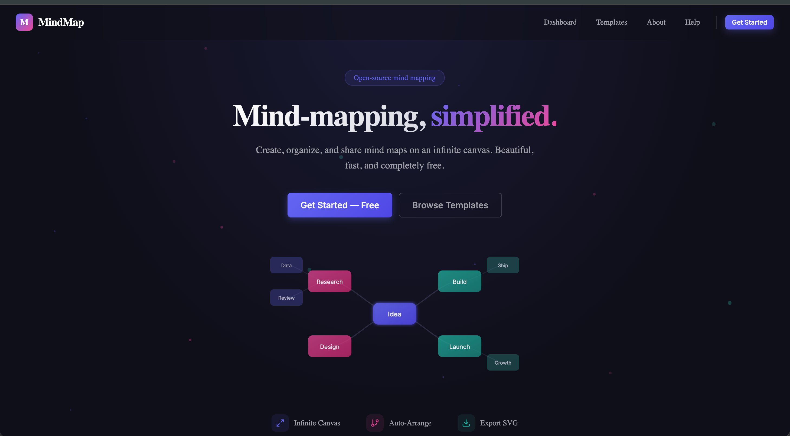
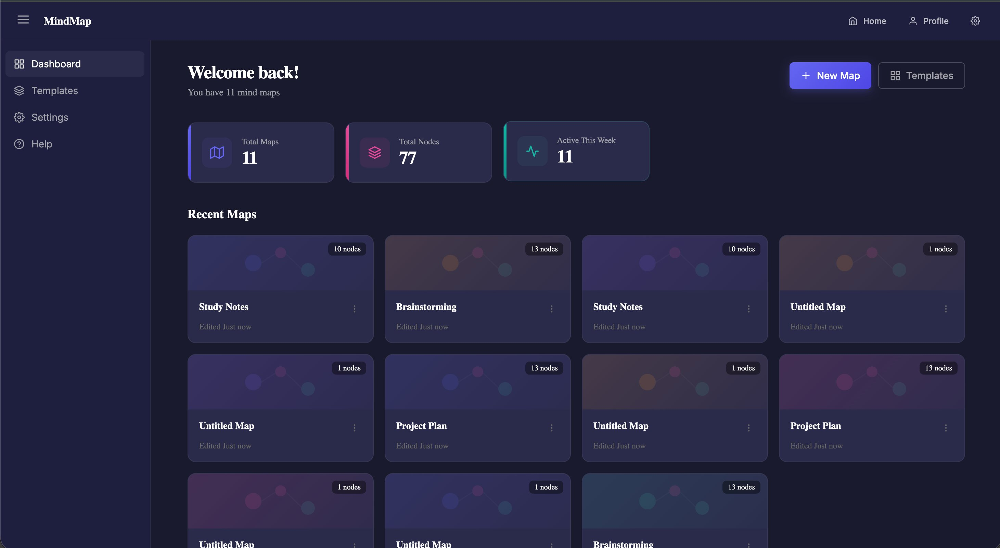
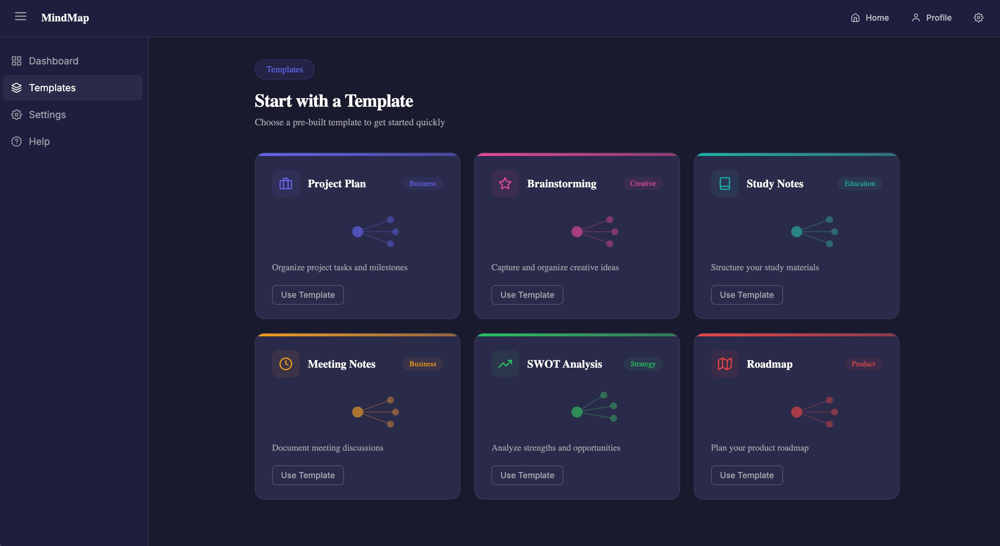
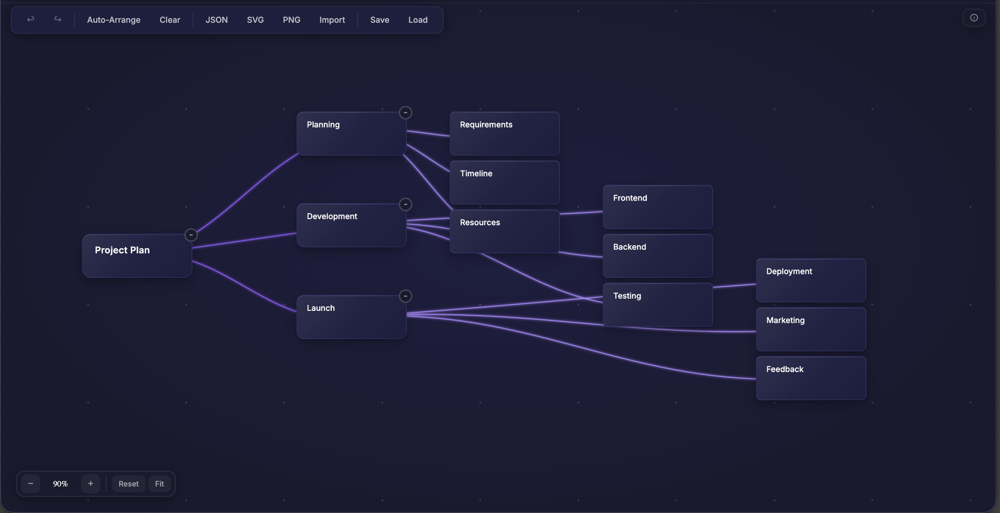

# 🧠 MindMap — Mind-mapping, simplified.

> Create, organize, and share mind maps on an infinite canvas. Beautiful, fast, and completely free.



---

## ✨ Features

- **Infinite Canvas** — Pan and zoom freely across an unlimited workspace
- **Auto-Arrange** — Automatically lay out nodes into a clean, readable tree
- **Export Options** — Save your mind maps as JSON, SVG, or PNG
- **Import Support** — Load previously exported JSON maps
- **Collapsible Branches** — Collapse/expand subtrees to keep things tidy
- **Undo / Redo** — Full history support for every action
- **Templates** — Start quickly with pre-built templates (Project Plan, Brainstorming, Study Notes, SWOT Analysis, and more)
- **Dashboard** — Manage all your mind maps in one place
- **Auto-save** — Changes are saved automatically every 30 seconds
- **Dark Theme** — Sleek dark UI built for long sessions

---

## 📸 Screenshots

### Dashboard


### Templates


### Editor


---

## 🛠️ Tech Stack

| Layer | Technology |
|---|---|
| Framework | React 19 + TypeScript |
| Build Tool | Vite 8 |
| Routing | React Router DOM v7 |
| State Management | Zustand |
| Local Database | Dexie (IndexedDB) |
| Animations | Framer Motion |
| Icons | React Icons |
| Export | file-saver |
| Unique IDs | uuid |
| Styling | Custom CSS (dark theme) |

---

## 🚀 Getting Started

### Prerequisites

- Node.js (v18 or higher recommended)
- npm

### Installation

```bash
# Clone the repository
git clone [https://github.com/sameershaikh-20/mindmap-graph-builder.git]

# Navigate into the project
cd mindmap-graph-builder

# Install dependencies
npm install
```

### Development

```bash
npm run dev
```

The app will be available at `http://localhost:5173`.

### Build for Production

```bash
npm run build
```

Built files will be output to the `dist/` directory.

### Preview Production Build

```bash
npm run preview
```

### Lint

```bash
npm run lint
```

---

## 📁 Project Structure

```
src/
├── assets/              # Static assets
├── components/
│   ├── InfiniteCanvas/  # Zoomable/pannable canvas
│   ├── MindMapNode/     # Node rendering
│   ├── MapCard/         # Dashboard map cards
│   ├── WorkspaceOverlay/# Toolbar and overlays
│   ├── Sidebar/         # App sidebar navigation
│   ├── Navbar/          # App top navigation
│   ├── LandingNavbar/   # Landing page nav
│   ├── Footer/          # Footer component
│   └── UI/              # Shared UI components
├── constants/
│   ├── config.ts        # Colors, node defaults, zoom settings
│   └── routes.ts        # Route constants
├── contexts/
│   └── AuthContext.tsx  # Authentication context
├── db/                  # Dexie IndexedDB setup
├── hooks/
│   ├── useAutoLayout.ts       # Auto-arrange logic trigger
│   ├── useBezierPath.ts       # Edge curve calculations
│   ├── useDraggableNode.ts    # Node drag interactions
│   ├── useLocalStorage.ts     # Generic localStorage hook
│   ├── useLocalStorageSync.ts # Sync state to localStorage
│   ├── useMediaQuery.ts       # Responsive breakpoints
│   └── useNodeSelection.ts    # Node selection state
├── layouts/
│   ├── AppLayout.tsx          # Authenticated app layout
│   ├── AuthLayout.tsx         # Auth pages layout
│   └── LandingLayout.tsx      # Public landing layout
├── pages/
│   ├── Landing/         # Home / marketing page
│   ├── Dashboard/       # Map list and management
│   ├── Editor/          # The main mind map editor
│   ├── Templates/       # Template browser
│   ├── Settings/        # User settings
│   ├── Profile/         # User profile
│   ├── Help/            # Help page
│   ├── About/           # About page
│   └── NotFound/        # 404 page
├── services/            # API / data service layer
├── store/               # Zustand store definitions
├── types/
│   ├── index.ts         # Core types (Node, GraphState, etc.)
│   ├── maps.ts          # Map-related types
│   └── user.ts          # User types
└── utils/
    ├── bezierCalculator.ts   # Bezier curve math
    ├── exportUtils.ts        # JSON / SVG / PNG export
    ├── graphAlgorithms.ts    # Graph traversal helpers
    ├── layoutEngine.ts       # Auto-arrange layout engine
    └── validation.ts         # Input validation helpers
```

---

## 🎨 Node Colors

Nodes support 12 built-in accent colors:

`#6366f1` · `#8b5cf6` · `#ec4899` · `#f43f5e` · `#ef4444` · `#f97316` · `#f59e0b` · `#84cc16` · `#22c55e` · `#14b8a6` · `#06b6d4` · `#3b82f6`

---

## 📦 Available Templates

| Template | Category | Description |
|---|---|---|
| Project Plan | Business | Organize project tasks and milestones |
| Brainstorming | Creative | Capture and organize creative ideas |
| Study Notes | Education | Structure your study materials |
| Meeting Notes | Business | Document meeting discussions |
| SWOT Analysis | Strategy | Analyze strengths and opportunities |
| Roadmap | Product | Plan your product roadmap |

---

## 📄 License

This project is private. All rights reserved.
